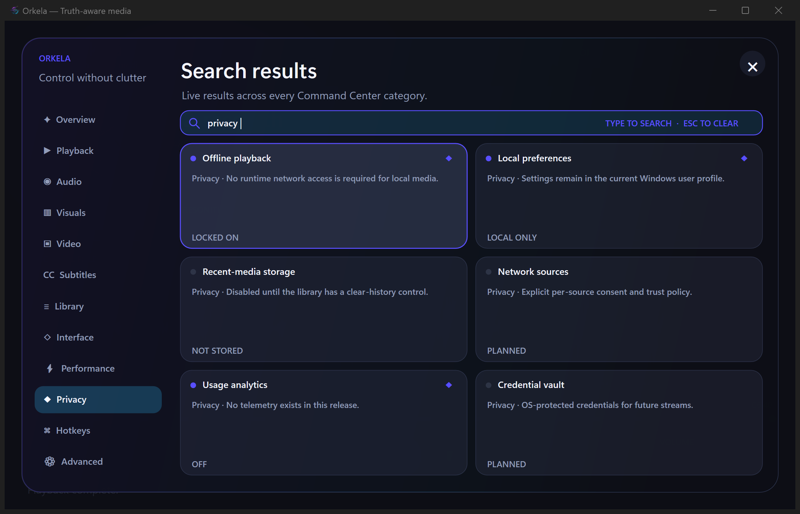

# Orkela Command Center Runtime Evidence

Date: 2026-07-27  
Status: **PARTIAL RELEASE GATE PASS / FINAL QA OPEN**

## Exact build

- Source commit: `40df79dfcdd4a75e4958c28d88ea55e02fc063c4`
- Windows workflow:
  [30224571078](https://github.com/moshkinyevhen/orkela/actions/runs/30224571078)
- Validation prerelease:
  [`orkela-ci-40df79d`](https://github.com/moshkinyevhen/orkela/releases/tag/orkela-ci-40df79d)
- Executable: `Orkela.exe`, 673,280 bytes
- Executable SHA-256:
  `b32ab37a5ade595883b7f29e3ec596d4185d7ded2972ad47db326b89b135594f`
- Embedded version: `0.2.0-alpha.2`
- Build policy: Windows x64 Release, MSVC `/W4 /WX`

## Long-form playback probe

Input: complete 400.773-second Mozart Resonith reference, 6,508,774 bytes,
SHA-256
`77eb9751603f4a37fae4ef961ab3423accbc0bef576ee2101f4081b3616edf8b`.

The exact CI executable opened the input, decoded outside the Windows message
thread, accepted Command Center interaction, and remained responsive:

| Elapsed | Responding | Process CPU | Working set |
|---:|:---:|---:|---:|
| 3 s | yes | 5.719 s | 126.8 MiB |
| 8 s | yes | 8.688 s | 121.6 MiB |
| 13 s | yes | 11.672 s | 121.7 MiB |
| 18 s | yes | 14.688 s | 125.7 MiB |
| 23 s | yes | 17.703 s | 125.8 MiB |
| 28 s | yes | 20.703 s | 125.8 MiB |

After decode, native playback started and the process remained responsive.

## Command Center probe

- Opened the real Command Center while the Mozart session remained loaded.
- Entered `privacy` through the window character-input path.
- Received six matching results from the Privacy category.
- Verified the new twelve-category navigation at 200% DPI.
- Verified explicit `LOCKED ON`, `LOCAL ONLY`, `NOT STORED`, `OFF`, and
  `PLANNED` states instead of inert controls presented as working features.

## Remaining release blockers

This is not the final `0.2.0-alpha.2` report. The final tag remains blocked
until 100% and 150% DPI, minimum and constrained layouts, reduced-motion
behavior, malformed input, all transport actions, persistence, associations,
and the complete release-evidence checklist pass against the final executable.
